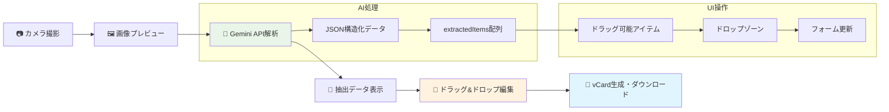
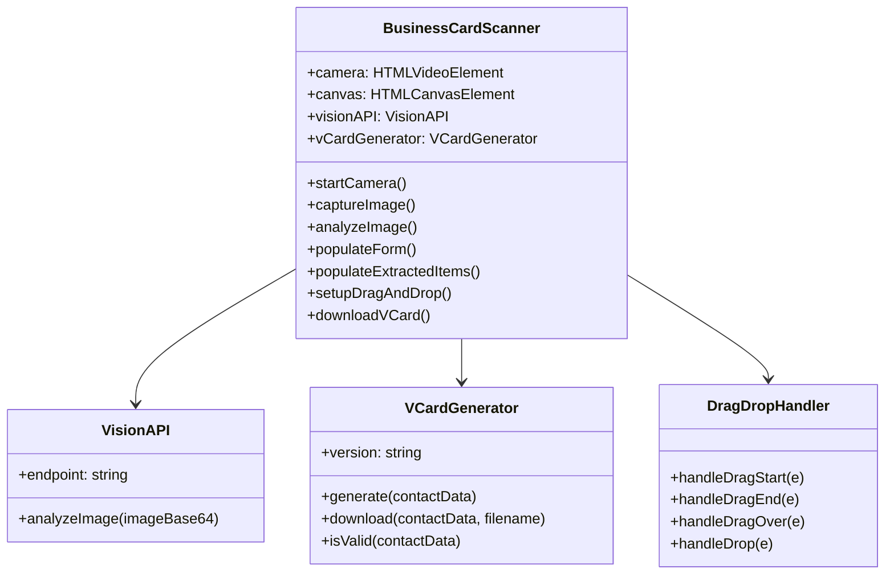
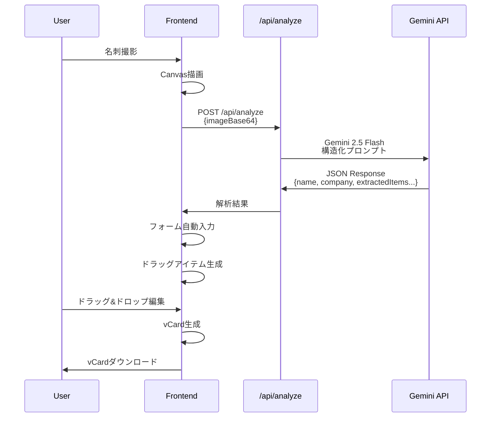
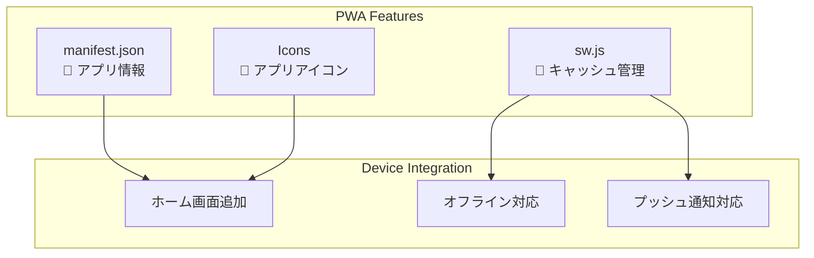
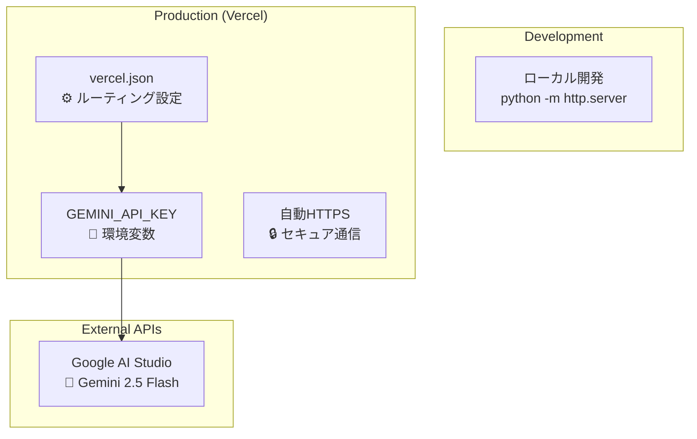

# 名刺スキャナーアプリ アーキテクチャ図

## システム全体図

```mermaid
graph TB
    subgraph "Frontend (PWA)"
        A[index.html] --> B[script.js]
        A --> C[style.css]
        B --> D[api.js]
        B --> E[vcard.js]
        F[sw.js] --> A
        G[manifest.json] --> A
    end
    
    subgraph "Vercel API Routes"
        H[/api/analyze.js]
    end
    
    subgraph "External Services"
        I[Gemini 2.5 Flash API]
        J[Camera API]
    end
    
    subgraph "User Devices"
        K[スマートフォン]
        L[vCard File]
    end
    
    D --> H
    H --> I
    J --> B
    E --> L
    K --> A
    
    style A fill:#e1f5fe
    style B fill:#f3e5f5
    style H fill:#fff3e0
    style I fill:#e8f5e8
```

## データフロー図



## ファイル構成と責任

```mermaid
graph TD
    subgraph "Frontend Files"
        A[index.html<br/>📄 UI構造定義]
        B[script.js<br/>🎮 メインロジック]
        C[style.css<br/>🎨 スタイル・アニメーション]
        D[api.js<br/>🔗 API通信]
        E[vcard.js<br/>📇 vCard生成]
        F[sw.js<br/>⚙️ Service Worker]
        G[manifest.json<br/>📱 PWA設定]
    end
    
    subgraph "Backend API"
        H[/api/analyze.js<br/>🧠 Gemini API統合]
    end
    
    subgraph "Configuration"
        I[vercel.json<br/>⚙️ デプロイ設定]
        J[CLAUDE.md<br/>📚 プロジェクト仕様]
    end
    
    A --> B
    B --> D
    B --> E
    D --> H
    F --> A
    G --> A
```

## クラス・関数関係図



## API通信フロー



## ドラッグ&ドロップ仕組み

```mermaid
graph LR
    subgraph "Extracted Items"
        A[draggable-item<br/>data-text="山田太郎"]
        B[draggable-item<br/>data-text="部長"]
        C[draggable-item<br/>data-text="03-1234-5678"]
    end
    
    subgraph "Drop Zones"
        D[drop-zone[data-field="name"]<br/>👤 名前フィールド]
        E[drop-zone[data-field="title"]<br/>💼 役職フィールド]
        F[drop-zone[data-field="phone"]<br/>📞 電話フィールド]
    end
    
    A -.->|drag & drop| D
    B -.->|drag & drop| E
    C -.->|drag & drop| F
    
    style A fill:#e3f2fd
    style B fill:#e8f5e8
    style C fill:#fff3e0
```

## PWA機能構成



## 環境変数・設定



この関係図により、アプリの全体構造とコンポーネント間の関係が明確になります。